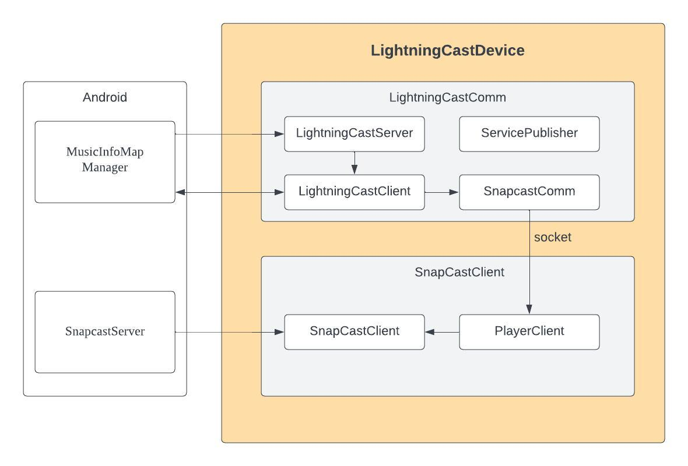

# LightningCastDevice Architecture Design

## 1. Overview

LightningCastDevice uses the LightningCast protocol to communicate with Android devices customized based on LightningCast. It retrieves metadata, audio format, playback progress, and other information from music apps and plays them through SnapCastClient. Additionally, it can control the current app's playback, such as play and pause operations, while keeping the Android volume and mute status synchronized.

The Android component consists of two parts: **LightningCastDeviceSample** and **SnapCastClient**. These communicate via sockets, allowing one device to receive or control metadata and other messages while another device plays the music.

## 2. Framework Diagram

<div align=center>

</div>

## 3. LightningCastDeviceSample

LightningCastDeviceSample comprises four threads: **ServicePublisher**, **LightningCastServer**, **LightningCastClient**, and **SnapcastComm**.

### 3.1 ServicePublisher

ServicePublisher registers an mDNS discovery service of type `_lightningcast._tcp`, enabling Android devices to discover the LightningCastDevice.

### 3.2 LightningCastServer

LightningCastServer starts a TCP server on port `7700`. When an Android device discovers this device via the mDNS service and selects it, it acts as a TCP client to connect to LightningCastServer and sends an `open` message. Upon receiving this message, LightningCastServer invokes the `Open` interface of LightningCastClient.

### 3.3 LightningCastClient

The `Open` interface of LightningCastClient acts as a TCP client connecting to Android, maintaining the connection by sending heartbeat packets every 500ms. When Android is playing, it sends metadata, cover art, audio format, playback progress, and other information through this connection. LightningCastDevice also sends control messages to Android through this connection. Both devices synchronize volume adjustments and mute status via this connection. Upon receiving a `play` message, it calls the `Open` and `sendStart` interfaces of SnapcastComm. When a `pause` or `stop` message is received, it calls the `sendPause`, `sendStop`, and `Close` interfaces of SnapcastComm.

### 3.4 SnapcastComm

The `Open` interface of SnapcastComm establishes a connection with SnapCastClient's PlayerClient via a socket. The `sendStart` interface sends a `start` message to SnapCastClient, while `sendPause` and `sendStop` send `stop` messages. The `Close` interface terminates the connection with PlayerClient.

## 4. [SnapCastClient](https://github.com/auralic/LightningCast-Android-SnapCast/tree/main/SnapCastClient)

SnapCastClient consists of two threads: **PlayerClient** and **SnapCastClient**.

### 4.1 PlayerClient

PlayerClient creates a socket server. Upon receiving `start` and `stop` messages from SnapcastComm, it calls the `start` and `stop` interfaces of SnapCastClient, respectively.

### 4.2 SnapCastClient

The `start` interface of SnapCastClient invokes the `Controller` interface of `snapcast_client` to begin connecting to Android's SnapCastServer for playback. The `stop` interface interrupts the playback connection.

## 5. Build

```bash
mkdir build
cd build
cmake ..
make
```

## 6. Run

Put LightningCastDeviceSample and SnapCastClient in the same directory and execute:

```bash
./SnapCastClient &
./LightningCastDeviceSample
```
